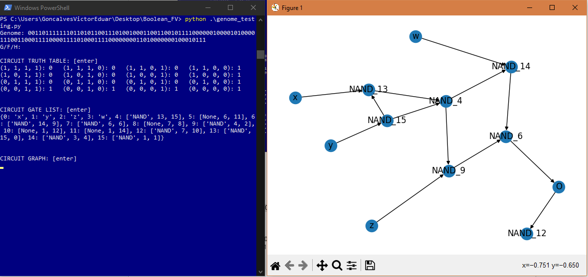

# Boolean_FV
A recreation of the paper by Parter et al., [Facilitated Variation: How Evolution Learns from Past Envirionments To Generalize to New Environments](https://journals.plos.org/ploscompbiol/article?id=10.1371/journal.pcbi.1000206). We evolve logic gate circuits to satisfy a boolean function goal.

## Overview

## Instructions
To setup experiments, change the constants.py file before running the experiments. We conduct experiments to test the [Theory of Facilitated Variation](https://www.pnas.org/doi/10.1073/pnas.0701035104#:~:text=In%20answer%2C%20the%20theory%20of,variety%20of%20regulatory%20targets%20for) by switching between fixed goals (FG) and modularly varying goals (MVG). Do switch these set the constant CHANGING_GOAL = True or False respectively. To run the simulation and learn logic circuits that fit the goal function, run:
```bash
python main.py
```

To load a save, drag the file from the saves folder into the loads folder. Then run:
```bash
python main.py [filename]
```

## Example

